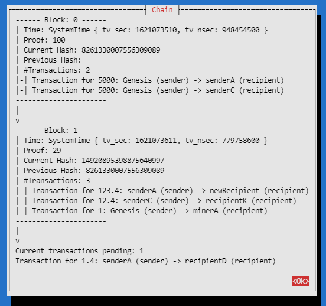
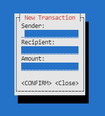
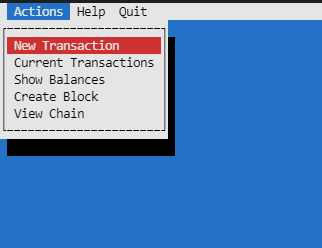

# rustBlockchain
A simple implementation of a blockchain in rust, with a cursive UI to go with it for easy interaction.

You can view your chain graphically:




As well as add transactions and create blocks:


# Installation
It is a simple project to setup:
1. Clone the repo
2. Install rust and cargo https://rustup.rs/
2. Install ncurses per https://github.com/gyscos/cursive/wiki/Install-ncurses

# Running
From within the repo directory:
1. Enter the cargo project directory
```
cd blockchain
```
2. Build the project
```
cargo build
```
3. Run the project
cargo run

# Usage
From within the UI press \<ESC\> to access the menu.



You can do the following from the 'Actions' menu:
- View Chain = View the chain and pending transactions
- Show Balances = See which accounts/wallets on the chain have what balances (useful to know where you can send transactions from)
- New Transaction = Create a transaction between wallets. This will show up on the 'View Chain' as a current transaction until immortalised into a block. Use the 'Show Balances' to see what wallets you can send tokens from. The recipient can be any string.
- Create Block = Simulate the act of mining and block creation, this takes current transactions and forms a new block, crediting some of the token to a mining account

To quit select 'Quit' from the menu bar or use Ctrl+C.

Note: there is no persistance between runs or any concensus algorithm, this is just a simple local toy blockchain.

# Code Tour
The project is laid out as follows:
- main.rs has the entry point 
- blockchain.rs
- interface.rs

# Feature Wishlist
To flesh this out further the following would be required:
- Persistance of the chain, saving and loading to disk
- Improvement of the 'mining' both in terms of proof of work and allocating of token reward
- Creation of multiple nodes and a concensus algorithm between nodes
- Fleshing out with a REST API to allow it to run on a simple server